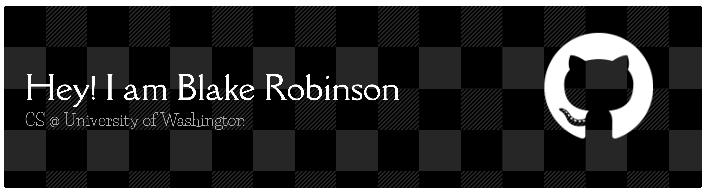

 

I am a **Computer Science** student at the **University of Washington** with a focus on building functional, high-performance, and visually engaging software. Whether I’m leading software teams for robotics or helping students debug complex logic as a **Teaching Assistant**, I’m driven by the intersection of systems engineering and creative design.

 

    

---

### What I’m Working On

* **Engineering Horizons:** Currently serving as the Software Team Lead for our Raspberry Pi-based rover project. We’re focusing on autonomous navigation and hardware integration.
* **Retro Portfolio:** Building a personal portfolio site with a **Retro Windows OS aesthetic** using **React** and **Vite**.
* **Automation:** Writing Python-based automation tools to streamline data extraction from professional platforms like Handshake.
* **Google Tools:** Writing internal google add-ons to the process of making accessible resources is easy and convinent.

---

### Academic & Leadership

* **Teaching Assistant:** Facilitating computer science courses at UW, where I lead sections and help students master fundamental programming concepts.
* **Engineering Horizons Officer:** Managing software workflows and coordinating between hardware and firmware teams to ensure project milestones are met.
* **Global Perspectives:** Currently preparing for study abroad programs to broaden my perspective on international tech ecosystems.

---

### 📫 Connect with Me

<!-- * **Portfolio:** [Link to your retro portfolio] -->
* **LinkedIn:** https://www.linkedin.com/in/blake-robinson002400/
* **Email:** b.robinson.cse@gmail.com 

<!--   -->

<!-- 
 -->

<!--  -->

<!-- 
 -->

---
> "The best way to predict the future is to invent it."